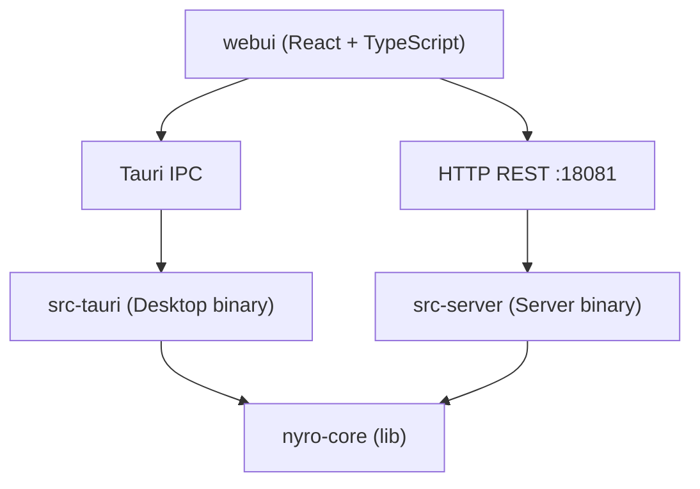

# Nyro AI Gateway — 架构设计

---

## 1. 产品定位与部署形态

Nyro 是一个**本地运行**的 AI 协议代理网关，让任意使用 OpenAI / Anthropic / Gemini SDK 的客户端工具（Claude Code、Codex CLI、Gemini CLI、OpenCode 等）无需改代码，仅修改 `base_url` 即可将请求路由到任意 LLM Provider。

```
Claude Code · Codex CLI · Gemini CLI · OpenCode
     OpenAI SDK · Anthropic SDK · Gemini SDK
              Any HTTP API Client
                      ↓
              Nyro AI Gateway
            (localhost:19530)
                      ↓
    OpenAI · Anthropic · Google · DeepSeek
    MiniMax · xAI · Zhipu · Ollama · ...
```

**两种部署形态：**

| 形态 | 实现 | 适用场景 |
|---|---|---|
| Desktop | Tauri v2 桌面应用（macOS / Windows / Linux） | 个人开发者，零部署，数据不离开本机 |
| Server | 独立 Rust 二进制，HTTP 管理 API + WebUI | 自托管、团队共享 |

核心原则：`nyro-core` 只暴露纯 Rust API（struct + async fn），**不感知传输层**。Desktop 版通过 Tauri IPC 调用，Server 版通过 HTTP REST 调用。

---

## 2. Workspace 分层（PR-01~17 最终形态）

```
nyro/
├── Cargo.toml
├── crates/
│   └── nyro-core/
│       └── src/
│           ├── proxy/                    # 代理面
│           │   ├── context.rs            # RequestContext（PR-02）
│           │   ├── dispatcher.rs         # 单点编排管线（PR-03/16）— ProviderAdapter 驱动
│           │   ├── handler.rs            # models_list 端点（≤110 行）
│           │   ├── ingress/              # 5 个薄 ingress shell（PR-03/16）
│           │   │   ├── openai_chat.rs       # decode → dispatch_pipeline
│           │   │   ├── openai_embeddings.rs # decode → dispatch_pipeline
│           │   │   ├── openai_responses.rs  # decode → dispatch_pipeline
│           │   │   ├── anthropic_messages.rs
│           │   │   └── google_generate.rs   # decode_with_model → dispatch_pipeline
│           │   └── stream.rs             # StreamBridge 状态机（PR-05）
│           ├── protocol/                 # 协议转换引擎
│           │   ├── ids.rs                # ProtocolId / ProtocolCapabilities（PR-07）
│           │   ├── traits.rs             # ProtocolHandler trait
│           │   ├── registry.rs           # ProtocolRegistry（PR-04）
│           │   ├── types.rs              # InternalRequest / InternalResponse / IR（PR-06）
│           │   ├── ir/                   # AiRequest / AiResponse 骨架（PR-06）
│           │   ├── codec/                # 编解码器 + ProtocolHandler 注册壳（PR-14）
│           │   │   ├── openai/
│           │   │   │   ├── chat.rs       # OpenAIChatV1 注册 shell
│           │   │   │   ├── embeddings.rs # OpenAIEmbeddingsV1 + 完整 codec（PR-12）
│           │   │   │   ├── decoder.rs
│           │   │   │   ├── encoder.rs
│           │   │   │   ├── stream.rs
│           │   │   │   ├── types.rs
│           │   │   │   └── responses/
│           │   │   │       ├── handler.rs # OpenAIResponsesV1 注册 shell（PR-09）
│           │   │   │       ├── decoder.rs
│           │   │   │       ├── encoder.rs
│           │   │   │       ├── parser.rs
│           │   │   │       ├── formatter.rs
│           │   │   │       └── stream.rs
│           │   │   ├── anthropic/
│           │   │   │   ├── messages.rs  # AnthropicMessages2023 注册 shell（PR-10）
│           │   │   │   ├── decoder.rs
│           │   │   │   ├── encoder.rs
│           │   │   │   ├── stream.rs
│           │   │   │   └── types.rs
│           │   │   ├── google/
│           │   │   │   ├── generate.rs  # GoogleGenerateV1Beta 注册 shell（PR-11）
│           │   │   │   ├── decoder.rs
│           │   │   │   ├── encoder.rs
│           │   │   │   ├── stream.rs
│           │   │   │   └── types.rs
│           │   │   ├── reasoning.rs     # think-tag 提取工具（来自 PR-14）
│           │   │   └── tool_correlation.rs # tool_call_id 关联与恢复
│           │   └── vendor/              # 兼容桥接层（PR-13/15）
│           │       └── mod.rs           # re-export → crate::provider（向后兼容）
│           ├── provider/                 # ProviderAdapter 编排层（PR-15）
│           │   ├── adapter.rs            # ProviderAdapter trait + ProviderCtx
│           │   ├── vendor_ext.rs         # VendorExtension trait + VendorCtx（已迁移）
│           │   ├── metadata.rs           # VendorMetadata / Label / AuthMode
│           │   ├── registry.rs           # VendorRegistry + ProviderAdapterRegistry
│           │   ├── outbound.rs           # OutboundRequest（wire-format 请求）
│           │   ├── inbound.rs            # InboundResponse（wire-format 响应）
│           │   ├── stream.rs             # ProviderStreamParser + LegacyStreamParserAdapter
│           │   ├── common/openai.rs      # openai_compat_build_request/parse_response 等共用逻辑
│           │   ├── openai/               # OpenAiVendor：VendorExtension + ProviderAdapter
│           │   │   └── codex/            # OpenAiCodexChannel（OAuth 渠道）
│           │   ├── anthropic/
│           │   │   └── claude_code/      # 占位（OAuth 待实现）
│           │   ├── google/
│           │   │   └── gemini_cli/       # 占位（OAuth 待实现）
│           │   ├── deepseek/
│           │   ├── moonshotai/
│           │   ├── zhipuai/
│           │   ├── minimax/
│           │   ├── xai/
│           │   ├── zai/
│           │   ├── nvidia/
│           │   ├── openrouter/
│           │   ├── ollama/
│           │   └── custom/
│           ├── error.rs                  # GatewayError taxonomy（PR-01）
│           ├── router/
│           ├── storage/
│           │   ├── sqlite/
│           │   └── postgres/
│           ├── db/
│           ├── logging/
│           ├── crypto/
│           ├── cache/
│           └── admin/                    # AdminService 管理面核心逻辑（按职责拆分）
│               ├── mod.rs                # 公共类型、模块声明、AdminService 构造
│               ├── providers.rs          # Provider CRUD / 复制 / 连通性测试 / 模型发现
│               ├── oauth.rs              # OAuth session、Provider 绑定、重连、登出与刷新
│               ├── routes.rs             # Route CRUD、target 写入与 route cache reload
│               ├── api_keys.rs           # API Key CRUD 与名称唯一性校验
│               ├── settings.rs           # Settings 与 cache runtime 管理
│               ├── observability.rs      # 请求日志查询与统计概览
│               ├── import_export.rs      # 配置导入 / 导出
│               ├── model_catalog.rs      # models.dev 缓存、模型列表与能力解析
│               ├── auth_data.rs          # OAuth credential/session DTO 转换 helper
│               ├── route_data.rs         # Route target/cache 归一化与校验 helper
│               └── session_tests.rs      # auth session 私有状态机单元测试
├── src-tauri/
├── src-server/
└── webui/
```

**依赖关系：**



**nyro-core 核心 API：**

```
Gateway::new(config)      → 初始化数据库、启动代理服务
Gateway::start_proxy()    → 启动 axum HTTP Server（代理面）
Gateway::admin()          → 返回 AdminService，提供全部管理操作
  ├── .list_providers()
  ├── .create_provider(input)
  ├── .test_provider(id)
  ├── .list_routes()
  ├── .query_logs(filter)
  ├── .get_stats_overview()
  └── ...
Gateway::shutdown()       → 优雅关闭
```

`AdminService` 是管理面唯一入口，但内部实现按功能职责分布在
`crates/nyro-core/src/admin/` 子模块中。外部调用方仍只通过
`Gateway::admin()` 获取服务实例；子模块仅用于维护边界划分，不引入新的传输层或
运行时抽象。公开管理面回归测试位于 `crates/nyro-core/tests/admin.rs`；只有需要访问私有
auth-session 状态机的测试保留在 `admin/session_tests.rs`。

---

## 3. 协议转换架构（PR-01~14 最终形态）

### 3.1 核心设计原则

- **统一错误 taxonomy**（PR-01）：`GatewayError` 覆盖 15 种错误类型，每个错误有稳定 code、HTTP status、user message、internal detail 和 retryable 标志。
- **请求生命周期追踪**（PR-02）：`RequestContext` 携带 request_id、deadline、cancellation token 和 outcome，贯穿所有层。
- **确定性协议协商**（PR-04）：三级 egress 解析（Exact → Same-family → Provider Default），`ProtocolRegistry` 统一别名规范化，消除 HashMap fallback 歧义。
- **StreamBridge 状态机**（PR-05）：七个明确状态（Init → UpstreamConnected → Streaming → … → Terminal），保证 parser error 不被吞掉、target success 只在 stream 完成后记录。
- **完整字段映射**（PR-08~12）：每个 codec 明确处理已知字段；vendor-specific 字段走三段化 `ingress / egress / passthrough_safe` 路径，不再隐式丢弃。
- **VendorExtension 层**（PR-13）：厂商 auth/URL/hook 逻辑收敛到 `provider/<name>/mod.rs`，OpenAI 兼容厂商共享 `provider/common/openai.rs` 免重复代码。
- **ProviderAdapter 单点接口**（PR-15）：`dispatcher.rs` 只通过 `ProviderAdapter` trait 与厂商层交互，一次注册覆盖 build_request / parse_response / stream_parser / map_error / validate_environment，dispatch 管线不再感知具体 codec 或 vendor 实现细节。
- **dispatcher.rs 单点编排**（PR-16）：路由/鉴权/缓存/target 迭代/HTTP 调用/响应处理全部集中在 `dispatcher::dispatch_pipeline`，ingress shell 仅做 decode → 转发，handler.rs 缩减为 models_list 只读端点（≤110 行）。

### 3.2 完整调用流程（PR-16 最终形态）

```
+--------------------+                  +----------------------------------------+
| Client / CLI / SDK | -- HTTP/SSE --> | Ingress Shell (proxy/ingress/<proto>.rs)|
|                    |                  | - Ingress Decoder → InternalRequest    |
+--------------------+                  +-------------------+--------------------+
                                                         |
                                                         v
                                     +------------------------------------------+
                                     | dispatcher::dispatch_pipeline             |
                                     +-------------------+----------------------+
                                                         |
                                         ┌───────────────┴────────────────┐
                                         ▼                                ▼
                              Route lookup                         Cache check
                              + Auth/Quota                   Exact cache / Semantic cache
                              (authorize_route_access)       → 命中则直接返回 cached response
                                         │
                                         ▼
                             Target iteration（健康感知）
                                         │
                                         ▼
                    +----------------------------------------------------+
                    | ProviderProtocols::resolve_egress(ingress)         |
                    | → egress ProtocolId + egress_base_url              |
                    +----------------------------------------------------+
                                         │
                                         ▼
                    +----------------------------------------------------+
                    | ProviderAdapterRegistry::get(vendor_id)            |
                    | → ProviderAdapter（provider/openai/ 等）           |
                    +----------------------------------------------------+
                                         │
                                         ▼
                    +----------------------------------------------------+
                    | adapter.build_request(req, ctx)                    |
                    |   pre_request → normalize_tool_results             |
                    |   → pre_encode → codec_encode → post_encode        |
                    |   → auth_headers → build_url                       |
                    |   ↓ OutboundRequest { url, headers, body }         |
                    | + runtime_binding_headers（OAuth extra headers）   |
                    +----------------------------------------------------+
                                         │
                                         ▼
                    +----------------------------------------------------+
                    | Upstream HTTP Call (ProxyClient)                   |
                    +-----------+----------------------------------------+
                                │
                  ──────────────┴──────────────
                  │                            │
                  ▼                            ▼
      Non-Stream Response            Stream Response (SSE)
                  │                            │
                  ▼                            ▼
      adapter.parse_response()     egress.handler().make_stream_parser()
      → InternalResponse           + ingress.handler().make_stream_formatter()
      → reasoning normalize        → SSE 帧推送至 mpsc channel
      → ingress formatter          → tokio::spawn 异步写 cache + log
      → 写精确/语义缓存
                  │                            │
                  └──────────────┬─────────────┘
                                 ▼
                    Return to Client（JSON / SSE）

      Side Channel (async):
      +--------------------------------------------------------------+
      | usage / status / latency / tool flags → logging & stats     |
      | singleflight 广播 → 等待中的重复请求共享 cache entry         |
      +--------------------------------------------------------------+
```

### 3.3 内部表示（IR）

`crates/nyro-core/src/protocol/types.rs` 定义统一内部结构：

- `InternalRequest`：入站请求，含消息列表、工具定义、模型参数、`extra` HashMap（存放 vendor-specific 字段）
- `InternalResponse`：支持 reasoning_content、tool_calls、response_items
- `StreamDelta`：流式增量事件，支持 reasoning delta 与 text / tool_call 并行

`InternalRequest.extra` 的 key 命名约定：

| 前缀 | 用途 |
|---|---|
| `__anthropic_raw_*` | Anthropic cache_control / exotic blocks 无损往返 |
| `__google_raw_*` | Google systemInstruction / built-in tools / generationConfig |
| `__emb_*` | Embeddings 已知字段（input / dimensions / encoding_format / user） |
| `__vendor_ingress` | 未知 vendor 字段集合（由 VendorFieldPolicy 决定是否转发） |

---

## 4. 协议层（codec/）详情

### 4.1 ProtocolHandler 注册体系

每个 dialect 的注册 shell 位于对应 `codec/<family>/<dialect>.rs`，通过 `inventory::submit!` 在 binary 启动时自动注册进 `ProtocolRegistry`。无需手工列举，新 dialect 只需新增文件。

| 文件 | 注册的 ProtocolId |
|---|---|
| `codec/openai/chat.rs` | `openai/chat/v1` |
| `codec/openai/embeddings.rs` | `openai/embeddings/v1` |
| `codec/openai/responses/handler.rs` | `openai/responses/v1` |
| `codec/anthropic/messages.rs` | `anthropic/messages/2023-06-01` |
| `codec/google/generate.rs` | `google/generate/v1beta` |

### 4.2 ProtocolCapabilities 矩阵

每个 `ProtocolHandler` 通过 `capabilities()` 声明静态能力矩阵：

| 字段 | 类型 | 含义 |
|---|---|---|
| `streaming` | bool | 支持 SSE 流式 |
| `tools` / `function_calling` | bool | 支持 tool call |
| `reasoning` / `extended_reasoning` | bool | 支持 thinking / reasoning |
| `embeddings` | bool | Embeddings 端点 |
| `force_upstream_stream` | bool | 强制上游 streaming（Responses API） |
| `override_model_in_body` | bool | model 写入 URL path（Google） |
| `unknown_field_policy` | VendorFieldPolicy | Pass / Drop |
| `lossy_default_reject` | bool | lossy 转换默认拒绝 |

### 4.3 Codec 完整字段映射（PR-08~12）

**OpenAI Chat（PR-08）**：完整映射 logprobs、seed、response_format、parallel_tool_calls、audio 等 20+ 字段到 `extra`；reasoning 字段（reasoning_effort、o1 style）透传。

**OpenAI Responses（PR-09）**：force_upstream_stream=true；独立 decoder/encoder/parser/formatter；reasoning_item 的 summary text 提取。

**Anthropic Messages（PR-10）**：cache_control、thinking config、context_management、exotic blocks（Document / InputAudio）检测时保留 `__anthropic_raw_*` 做无损往返；built-in tools（web_search_call）作为 sentinel ToolDef 处理。

**Google GenerateContent（PR-11）**：完整 generationConfig（20+ fields）、safety_settings、built-in tools（googleSearch / codeExecution）处理；`__google_generation_config` 在 encoder 中被 model 参数覆盖（overlay）。

**OpenAI Embeddings（PR-12）**：VendorFieldPolicy::Drop；`__emb_*` 明确解析；unknown fields 进 `__vendor_ingress` 但不转发。

### 4.4 语义工具（codec/reasoning.rs & codec/tool_correlation.rs）

**reasoning.rs**：
- `normalize_response_reasoning`：结构化字段优先，`<think>` tag 兜底提取；已有 reasoning_content 时 no-op
- `split_think_tags`：多 `<think>` block 支持，未闭合 tag 保留为文本

**tool_correlation.rs**：
- `normalize_request_tool_results`：统一 tool_call_id 关联
  1. 精确 ID 匹配
  2. content hint 匹配（tool_use_id block）
  3. 工具名 hint 匹配
  4. FIFO fallback
  5. 孤儿 tool_result 时自动补合成 assistant message

---

## 5. 厂商扩展层（provider/）

PR-15 将厂商逻辑从 `protocol/vendor/` 迁移至顶层 `provider/` 目录，形成**三层职责分离**：

```
protocol/codec/   ← 序列化层：InternalRequest ↔ wire-format JSON
protocol/vendor/  ← 兼容桥接：re-export → crate::provider（向后兼容）
provider/         ← 编排层：VendorExtension hooks + ProviderAdapter 对外接口
```

### 5.1 ProviderAdapter trait（PR-15）

`dispatcher.rs` 的唯一接触点，封装完整的 vendor 请求/响应生命周期：

```rust
#[async_trait]
trait ProviderAdapter: Send + Sync + 'static {
    fn vendor_id(&self) -> &'static str;
    fn supported_protocols(&self) -> &'static [ProtocolId];

    /// pre_request → normalize_tool_results → pre_encode →
    /// codec_encode → post_encode → auth_headers → build_url
    async fn build_request(req: &mut InternalRequest, ctx: &ProviderCtx<'_>)
        -> Result<OutboundRequest, GatewayError>;

    /// pre_parse → codec_parse → normalize_reasoning → post_parse
    async fn parse_response(resp: InboundResponse, ctx: &ProviderCtx<'_>)
        -> Result<InternalResponse, GatewayError>;

    fn stream_parser(ctx: &ProviderCtx<'_>) -> Box<dyn ProviderStreamParser + Send>;
    fn map_error(status: u16, body: Value) -> GatewayError;
    fn validate_environment(provider: &Provider) -> Result<(), GatewayError> { Ok(()) }
}
```

`ProviderCtx` 携带：provider、resolved egress protocol、egress_base_url、api_key、actual_model、credential、Gateway 引用。

### 5.2 VendorExtension trait（PR-13/15，hook 细粒度层）

`VendorExtension` 是 `ProviderAdapter` 内部调用的 hook 层，**dispatcher.rs 禁止直接调用**：

```rust
trait VendorExtension: Send + Sync {
    fn scope(&self) -> VendorScope;           // Vendor | Channel
    fn auth_headers(&self, ctx) -> HeaderMap;
    fn build_url(&self, ctx, base, path) -> String;
    // 可选 hooks（默认 no-op）:
    async fn pre_request(ctx, req, gw);       // 调整 InternalRequest（如 Ollama 过滤 tools）
    async fn pre_encode(ctx, req);
    async fn post_encode(ctx, body, headers);
    async fn pre_parse(ctx, body);
    async fn post_parse(ctx, resp);
    async fn on_stream_chunk(ctx, delta);
    async fn on_stream_done(ctx, internal);
}
```

注册方式：各厂商 `mod.rs` 通过 `inventory::submit!(VendorRegistration { ... })` 自动注册进 `VendorRegistry`。

### 5.3 共用 helpers（provider/common/openai.rs）

所有 OpenAI 兼容厂商共用：
- `openai_bearer_auth_headers(ctx)` — 生成 `Authorization: Bearer <key>` headers
- `openai_build_url(base, path)` — URL 拼接
- `openai_map_error(vendor_id, status, body)` — 映射上游错误到 `GatewayError`
- `openai_compat_build_request(vendor, req, ctx)` — 共享 build_request 流水线
- `openai_compat_parse_response(vendor, resp, ctx)` — 共享 parse_response 流水线
- `openai_compat_stream_parser(ctx)` — 共享 stream_parser 工厂
- `GenericOpenAICompatibleAdapter` — 零大小通用实现
- `ThinkTagExtractingParser` — 包装 reasoning::split_think_tags

### 5.4 厂商列表

| 厂商 | vendor_id | 特殊处理 |
|---|---|---|
| OpenAI | `openai` | 含 codex 子模块（OAuth channel） |
| Anthropic | `anthropic` | `x-api-key` + `anthropic-version` headers |
| Google | `google` | URL 追加 `?key=<api_key>`；`override_model_in_body=true` |
| DeepSeek / Moonshot / Zhipu / MiniMax / xAI / ZAI / OpenRouter / Nvidia / Ollama | 各自 vendor_id | 均委托 `GenericOpenAICompatibleAdapter` / openai_compat_* |
| custom | `custom` | 用户自定义厂商 preset |

每个厂商 `mod.rs` 同时实现 `VendorExtension` + `ProviderAdapter`，双 `inventory::submit!` 注册（`VendorRegistration` + `ProviderAdapterRegistration`）。

### 5.5 VendorMetadata

每个厂商通过 `const METADATA: VendorMetadata`（位于 `provider/<vendor>/mod.rs`）声明能力矩阵，由 `VendorRegistry::list_metadata_legacy_json()` 聚合输出给 WebUI。

---

## 6. 错误处理（PR-01）

`GatewayError` 统一 taxonomy：

| 变体 | HTTP | 含义 |
|---|---|---|
| `BadRequest` | 400 | 客户端格式错误 |
| `Unauthorized` | 401 | 无有效 API Key |
| `Forbidden` | 403 | Key 状态异常或无权限 |
| `QuotaExceeded` | 429 | RPM / TPM / TPD 超限 |
| `RouteNotFound` | 404 | 无匹配路由 |
| `ProtocolUnsupported` | 400 | 协议不支持 |
| `ProtocolLossyRejected` | 422 | lossy 转换被拒绝 |
| `ProviderUnavailable` | 503 | 无可用 vendor extension |
| `UpstreamStatus` | 上游 status | 上游返回错误 |
| `UpstreamTimeout` | 504 | 上游超时 |
| `StreamParseError` | 502 | SSE chunk 解析失败 |
| `ClientCancelled` | 499 | 客户端断开 |
| `Internal` | 500 | 内部错误 |

每个错误由 `GatewayError::render(request_id)` 统一序列化为 OpenAI 兼容 JSON 错误格式。

---

## 7. 路由与访问控制

### 7.1 Route 模型

路由唯一键为 `(ingress_protocol, name)`：

| 字段 | 类型 | 说明 |
|---|---|---|
| `id` | TEXT PK | UUID |
| `name` | TEXT | 人类可读名称，同时作为客户端请求的模型匹配键（路由唯一键的一部分） |
| `ingress_protocol` | TEXT | 接入协议（canonical ProtocolId） |
| `target_provider` | TEXT FK | 目标模型提供商 |
| `target_model` | TEXT | 实际调用的模型 |
| `access_control` | BOOLEAN | 是否启用访问控制，默认 false |
| `is_active` | BOOLEAN | 路由启用状态，默认 true |

`name` 同时承担显示名称和路由匹配键两个角色。当客户端请求中的 `model` 值与某条路由的 `name` 精确匹配时，该路由被命中，请求被转发到 `target_provider` 的 `target_model`。

### 7.2 API Key 模型

Route 与 API Key 是**独立管理、多对多绑定**的关系：

```
API Key ──── (授权绑定) ──── Route
  │                            │
  ├── 配额: RPM / TPM / TPD     ├── 接入协议 (canonical ProtocolId)
  ├── 过期时间                  ├── 模型名 (精确匹配)
  ├── 状态: active / revoked   ├── 目标提供商 + 目标模型
  └── 名称                      └── 访问控制开关
```

Key 格式：`sk-<32位hex>`，AES-256-GCM 加密存储。

### 7.3 代理请求鉴权流程

```
1. 解析请求 → 提取 ingress_protocol, model, api_key
   (优先级: Authorization: Bearer > x-api-key)
2. match(ingress_protocol, model) → Route
   └── 未匹配 → GatewayError::RouteNotFound (404)
3. if route.access_control == false:
   └── 直接放行
4. if api_key 为空 → GatewayError::Unauthorized (401)
5. 验证 api_key:
   a. 不存在 → 401 invalid key
   b. status != 'active' → 403 key revoked
   c. expires_at < now → 403 key expired
   d. route 不在 key 绑定列表 → 403 forbidden
   e. 配额超限 (rpm / tpm / tpd) → GatewayError::QuotaExceeded (429)
6. 执行路由转发 → target_provider + target_model
```

---

## 8. 模型能力识别

### 8.1 ai:// 内部协议

Provider 配置中通过 `modelsSource` / `capabilitiesSource` 声明数据来源：

| 值类型 | 示例 | 说明 |
|---|---|---|
| HTTP URL | `https://api.openai.com/v1/models` | 直接向 HTTP 端点请求 |
| 内部协议 | `ai://models.dev/openai` | 从 Nyro 内嵌 / 缓存的 models.dev 数据中查询 |

### 8.2 VendorMetadata

每个厂商通过 `const METADATA: VendorMetadata`（位于 `provider/<vendor>/mod.rs`）声明，由 `VendorRegistry::list_metadata_legacy_json()` 聚合输出给 WebUI。

---

## 9. 存储与数据层

### 9.1 双后端

| 后端 | 适用形态 | 路径 |
|---|---|---|
| SQLite | Desktop（单用户本地） | `crates/nyro-core/src/storage/sqlite/` |
| PostgreSQL | Server（多用户自托管） | `crates/nyro-core/src/storage/postgres/` |

统一接口定义在 `crates/nyro-core/src/storage/` 抽象层，上层代码不感知具体后端。

### 9.2 核心表结构

```sql
-- 提供商配置
CREATE TABLE providers (
    id           TEXT PRIMARY KEY,
    name         TEXT NOT NULL,
    vendor       TEXT,              -- canonical vendor_id（custom / openai / ...）
    protocol     TEXT NOT NULL,     -- canonical protocol suite（openai-compatible / ...）
    base_url     TEXT NOT NULL,
    api_key      TEXT NOT NULL      -- AES-256-GCM 加密存储
);

-- 路由规则
CREATE TABLE routes (
    id                TEXT PRIMARY KEY,
    name              TEXT NOT NULL,    -- 显示名称 + 路由匹配键
    ingress_protocol  TEXT NOT NULL,   -- canonical ProtocolId
    target_provider   TEXT NOT NULL REFERENCES providers(id),
    target_model      TEXT NOT NULL,
    access_control    INTEGER NOT NULL DEFAULT 0,
    is_active         INTEGER NOT NULL DEFAULT 1,
    UNIQUE(ingress_protocol, name)
);

-- 访问控制 Key
CREATE TABLE api_keys (
    id         TEXT PRIMARY KEY,
    key        TEXT NOT NULL UNIQUE,  -- sk-<32位hex>
    name       TEXT NOT NULL,
    rpm        INTEGER,
    tpm        INTEGER,
    tpd        INTEGER,
    status     TEXT NOT NULL DEFAULT 'active',
    expires_at TEXT
);

-- Key 与 Route 的绑定关系
CREATE TABLE api_key_routes (
    api_key_id  TEXT NOT NULL REFERENCES api_keys(id) ON DELETE CASCADE,
    route_id    TEXT NOT NULL REFERENCES routes(id) ON DELETE CASCADE,
    PRIMARY KEY (api_key_id, route_id)
);

-- 请求日志
CREATE TABLE request_logs (
    id             TEXT PRIMARY KEY,
    route_id       TEXT,
    ingress_proto  TEXT,
    model          TEXT,
    status_code    INTEGER,
    latency_ms     INTEGER,
    input_tokens   INTEGER,
    output_tokens  INTEGER,
    created_at     TEXT
);
```

### 9.3 安全

- Provider API Key 使用 AES-256-GCM 加密存储，密钥派生自本机唯一标识
- Desktop 模式下管理 API 仅监听 `127.0.0.1`，外部不可访问
- Server 模式下管理端口与代理端口独立，可配置鉴权

---

## 10. 前端适配层

前端（`webui/`）通过薄抽象层兼容两种部署形态：

```typescript
// webui/src/lib/backend.ts

// Desktop 版：通过 Tauri IPC 调用
async function invokeIPC<T>(cmd: string, args?: object): Promise<T> {
  const { invoke } = await import('@tauri-apps/api/core');
  return invoke<T>(cmd, args);
}

// Server 版：通过 HTTP 调用
async function invokeHTTP<T>(cmd: string, args?: object): Promise<T> {
  const resp = await fetch(`/api/v1/${cmd}`, {
    method: 'POST',
    headers: { 'Content-Type': 'application/json' },
    body: JSON.stringify(args),
  });
  return resp.json();
}
```

**技术栈：**

| 层 | 技术 |
|---|---|
| 框架 | React 19 + TypeScript + Vite |
| 状态 | Zustand |
| 数据获取 | TanStack Query |
| 路由 | React Router v7 |
| 样式 | Tailwind CSS 4 |
| 图表 | Recharts |

---

## 11. 未实施能力 / Future Work（P2）

以下能力已在设计阶段识别，尚未实施，按优先级排列：

### 11.1 Pass-Through 路径

当 ingress/egress 协议一致且无需转换时，Gateway 应提供纯 pass-through 路径，不经过 IR 解析，最小化延迟和 CPU 开销，同时保证新厂商能力不被 Gateway 阻塞。

### 11.2 Quota 预留与结算

当前 quota 检查仅在请求前执行，并发场景存在超额风险。建议改为：
1. preflight 估算
2. atomic 预留
3. 执行请求
4. settle 实际用量
5. refund 未消费预留

stream 客户端 cancel 时也需结算已产生的 token。

### 11.3 Fixture 契约测试体系

```
tests/fixtures/protocol/
  openai_chat/
  openai_responses/
  anthropic_messages/
  google_generate/

tests/contract/
  openai_chat_to_anthropic.rs
  anthropic_to_openai_chat.rs
  google_to_openai_chat.rs

tests/stream/
  normal_done.rs
  upstream_disconnect.rs
  malformed_chunk.rs
  client_cancel.rs
  usage_in_final_chunk.rs
```

每个 fixture 覆盖：plain text / system+user+assistant / tool call / tool result / parallel tools / reasoning / image / structured output / stream / error response。

### 11.4 Compatibility Matrix CI

自动化验证每个 ingress→egress protocol 组合的支持程度（Native / Transform / LossyTransform / Reject），在 CI 中生成兼容性报告，防止回归。

### 11.5 Record-Replay

捕获真实上游请求/响应 pair，存为 fixture，用于：
- 离线复现 bug
- provider 更新后的兼容性测试
- 流式异常场景的精确重放

### 11.6 OpenTelemetry 集成

当前日志仅写本地 DB。P2 目标：通过 OTel SDK 输出 trace / metrics / logs，支持对接 Jaeger / Prometheus / Grafana 等标准可观测性平台，适配 Server 多用户场景。

### 11.7 长尾厂商适配

目前覆盖主流厂商（OpenAI / Anthropic / Google / DeepSeek / Moonshot / Zhipu / MiniMax / xAI / ZAI / OpenRouter / Nvidia / Ollama）。P2 待补充：
- AWS Bedrock（SigV4 签名 + wrapper protocol）
- Azure AI Foundry（Azure AD token + deployment URL pattern）
- Google Vertex AI（service account auth + regional endpoints）
- Cohere / Mistral / Together AI 等

### 11.8 Router 故障策略

当前路由命中后直接转发，无重试/failover。P2 目标：
- 多 provider 负载均衡（round-robin / weighted）
- 单 provider 上游超时自动重试（幂等场景）
- Provider health check + 自动摘除

### 11.9 Transport 策略

- HTTP/2 上游连接（降低延迟，复用连接）
- 连接池配置（per-provider max connections）
- 请求级超时精细化（connect_timeout / read_timeout / total_timeout 分离）
- 可配置重试策略（指数退避 + jitter）
